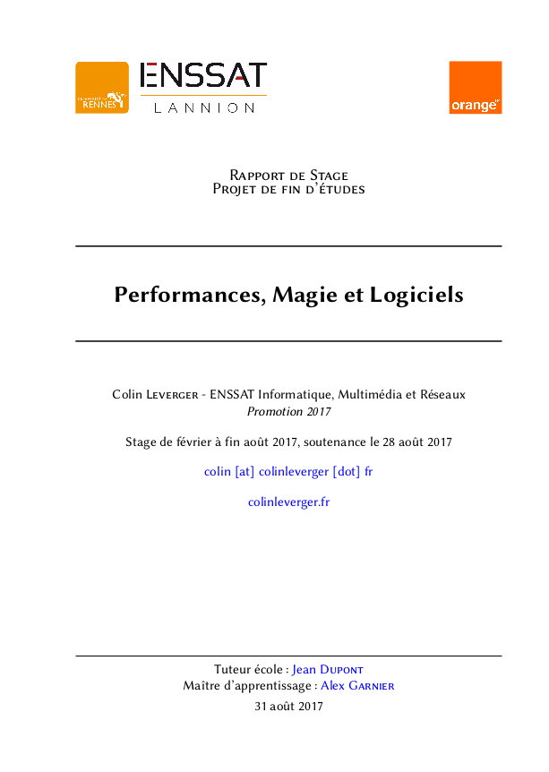
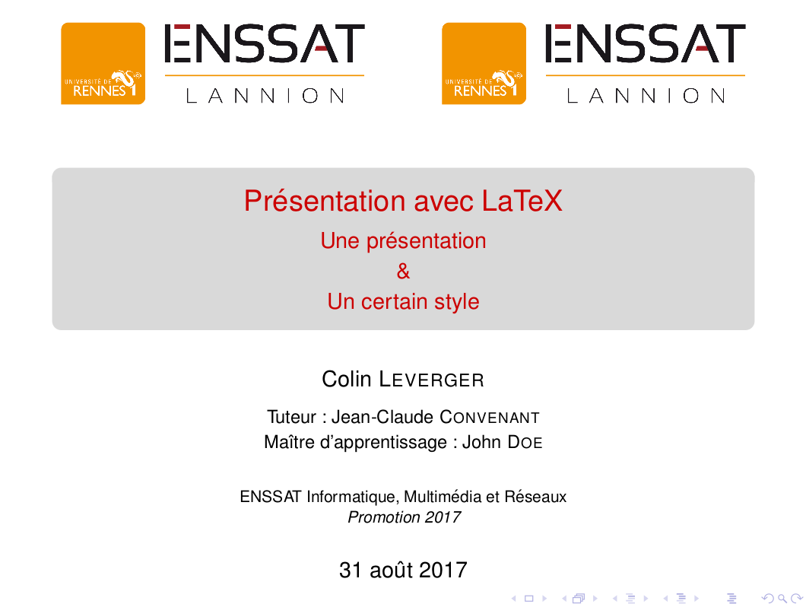

# Yet Another LateX Template Repository

Nice LaTeX templates for university students. I was studying at ENSSAT Lannion, so there is only my university logo now - but feel free to update the logos and whatever you need...

Folders are usually organised with a `params.tex` file which loads libraries and tune parameters, a file `report.tex` which you will need to latexify in order to generate the pdf, and also sometimes a bunch of subfiles included in the main file, to make organisation even more clear.

## Article English

Green template to write sort of articles, publications, etc.

See [this pdf](/article_en/article_1.pdf).

## Article French

Regular template to write an article (or a short report) in a school context.

See [this pdf](/article_fr/article.pdf).

## Beamer English

Clean Beamer presentation in English.

See [this pdf](/beamer_en/presentation.pdf).

## Internship Report French

Two-sided template to create end of study/6 months internship report. Makefile provided for Linux.
Built to be used with university and company logos.

See [this pdf](/internship-report_fr/report.pdf).

## School Report French

One sided report for school.

See [this pdf](/school-report_fr/template.pdf).
